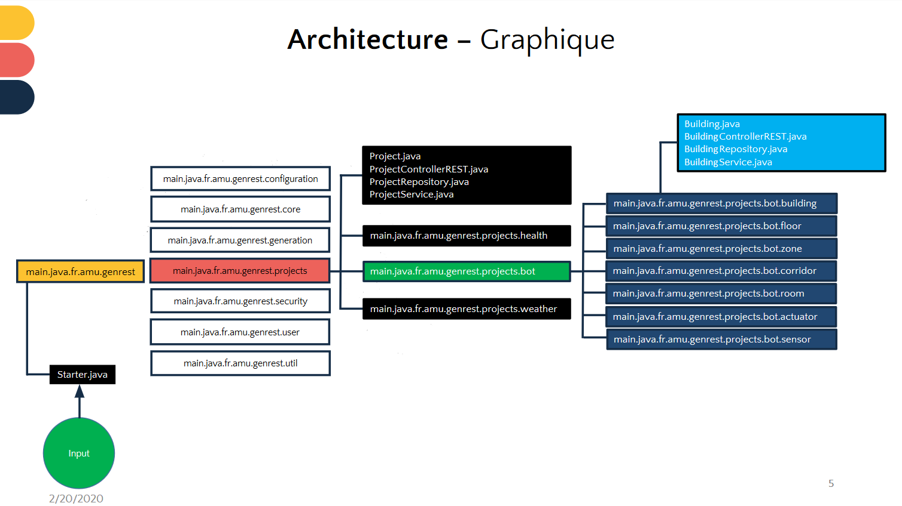

# api-genrest-spring
Ce projet est réaliser dans le cadre scolaire pour faire la migration vers spring-boot/spring-data d'un projet déjà existant.

## Instructions préliminaires
  - Pour La connexion à la base, il faut changer les information de connexion [MySQL 8] dans le fichier /resources/[application.properties](https://github.com/SLY-221/api-genrest-spring/blob/master/src/main/resources/application.properties).
  - Pour plus de simplicité dans nos JavaBeans, nous avons utilisé une librarie java **[Lombok](https://projectlombok.org/)** que nous avons ajouté dans notre fichier [pom.xml](https://github.com/SLY-221/api-genrest-spring/blob/master/pom.xml).
  - Néanmoins, pour profiter pleinement de cette librairie, il faudra exécuter le fichier jar dans le système [Windows 10 dans notre cas].
## Architecture de l'application
- Nous avons adopté l'architecture du packaging by features.
- Cette architecture nous permet de regrouper nos fonctionnalités par composants.

